# ECOSiO - E-Commerce Web App With Eco-Friendly Cosmetics For Men

Code Institute - Final Milestone Project (4) - Full Stack Frameworks With Django

ECOSiO is a multi-page e-commerce web application with a mission to make eco-friendly cosmetics easily available. 
The application focuses on men as target audience and offers a variety of products and content connected to sustainable
lifestyle. The primary purpose of this web app is to provide a trusted cosmetics marketplace for men interested in sustainability,
environmental issues and personal well-being. ECOSiO's core belief is that both environment and health always come first, 
and we should never be forced to choose one or another. 

As ECOSiO's vision is to revolutionise cosmetic industry from head to toe, the web app is strengthened by having 
features such as blog and loyalty programme. Sustainability can be an overwhelming and, quite often, an expensive choice,
therefore these features support the secondary purpose of the app which is helping customers to stay on the right track and enjoy 
the shopping experience. The idea behind this web app is not to provide a one-time shopping solution but to create a community 
of loyal customers.

Although the majority of the admin activities is done through [the Django admin site](https://docs.djangoproject.com/en/3.1/ref/contrib/admin/),
the web app also provides more pleasant environment for common tasks such as adding, editing and deleting products or blog posts through
the web app's UI.

**IMPORTANT (disclaimer): This project contains real products from existing brands. Please visit their websites for more information
if you wish to purchase them. Read more about how and why I've used them for this project in the 'Credits' section.**

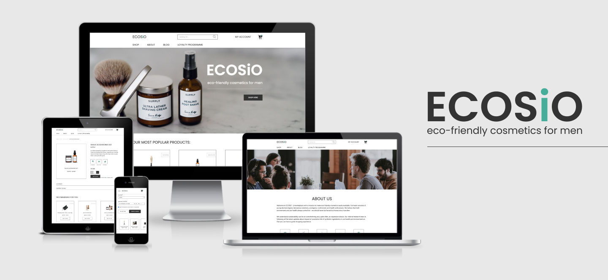

## Table of Contents

  * [**UX - research and goals**](#ux---research-and-goals)
    + [Conclusion of the Research](#conclusion-of-the-research)
    + [Business Goals](#business-goals)
    + [Customer Goals](#customer-goals)
  * [**Features and App Sections**](#features-and-app-sections)
    + [Web App Sections](#web-app-sections)
    + [Features and Django Apps](#features-and-django-apps)
    + [Features Left to Implement](#features-left-to-implement)
    + [Wireframes](#wireframes)
  * [**Information Architecture**](#information-architecture)
    + [Data Models](#data-models)
  * [**Graphic Design and Brand Elements**](#graphic-design-and-brand-elements)
    + [Fonts](#fonts)
    + [Colours](#colours)
    + [Icons](#icons)
    + [Images](#images)
    + [Visual Style](#visual-style)
  * [**Technologies Used**](#technologies-used)
  * [**Testing and Defensive Design**](#testing-and-defensive-design)
  * [**Deployment**](#deployment)
    + [Local Deployment](#local-deployment)
    + [Heroku Deployment](#heroku-deployment)
    + [Hosting Files with AWS](#hosting-files-with-aws)
    + [Sending E-mails through Gmail](#sending-e-mails-through-gmail)
  * [**Credits**](#credits)
    + [Content](#content)
    + [Media](#media)
    + [Inspiration Sources](#inspiration-sources)
    + [Coding Sources](#coding-sources)
    + [Acknowledgments](#acknowledgments)

## UX - research and goals

Who are 'green' consumers and why are they so interesting for this project? In [Green Consumerism: An A-to-Z Guide](https://sk.sagepub.com/reference/greenconsumerism/n71.xml)
green consumer has been defined as "_someone who is aware of his or her obligation to protect the environment by selectively purchasing
green products or services. A green consumer tries to maintain a healthy and safe lifestyle without endangering the sustainability of the 
planet and the future of mankind._" According to [GfK](https://digital.gfk.com/understanding-todays-green-consumer), the segment of customers
impacted by the eco-conscious trend has been steadily rising over the past years - from 53% of the overall customers in 2009 to 61% customers 
in 2019. The percentage is particularly high for younger customers, such as Millennials, according to [Global Web Index](https://blog.globalwebindex.com/chart-of-the-week/green-consumerism/).

However, [White, Hardisty and Habib](https://hbr.org/2019/07/the-elusive-green-consumer) write about a fascinating problem when it comes to
green consumers' buying behaviour. It seems that 65% of people say they want to buy from purpose-driven brands that advocate sustainability, 
yet only about 26% actually do so. The authors have been studying how to encourage sustainable consumption for several years, performing their 
own experiments and reviewing research in marketing, economics, and psychology. When it comes to men and sustainability in particular, 
the authors have found out that "some men associate sustainability with femininity, leading them to avoid sustainable options."

But what about men and cosmetics? According to [National Retail Federation](https://nrf.com/blog/rise-mens-cosmetics-and-brands-making-their-mark),
men's cosmetics is on the rise as a separate segment of the beauty industry. In the US alone, the revenue forecast for men's skincare products 
is expected [to grow to USD 18.92 billion by 2027.](https://www.grandviewresearch.com/industry-analysis/mens-skincare-products-market) However,
one of the major obstacles when it comes to encouraging men to buy cosmetics is in fact similar to the one mentioned earlier - [Blanchin, Chareyron and Levert](http://www.diva-portal.org/smash/get/diva2:238020/FULLTEXT01.pdf)
write that brands need to fight the widely spread belief that cosmetics is only for women in order to attract male customers.

### Conclusion of the Research

[White, Hardisty and Habib](https://hbr.org/2019/07/the-elusive-green-consumer) give a great example of how Tesla markets its environmentally
friendly cars - "Tesla focuses on the innovative design and functional performance of its cars more than on their green credentials — a message
that resonates with its target market. _This also helps overcome the concern of some men that green products are feminine._" Similarly, 
men's cosmetic industry is fighting that through [design and brand modifications.](https://nrf.com/blog/rise-mens-cosmetics-and-brands-making-their-mark)
It is clear that both of these industries rely heavily on the way the product is presented to the audience, as well as that they need much
stronger prompts and incentives to start the customer buying journey than other e-commerce businesses.

The growing interest in both of these topics indicates a promising potential for business development. On the one hand, sustainability is 
already widely spread as an interest but the users lack encouragement towards paying for such services. On the other hand, men's cosmetics 
as an industry is blooming but it still encounters obstacles, such as being associated with industries that are 'only for women.'

Since brand identity and incentives seem to be crucial for the user experience (along with the standard features related to e-commerce sites) 
these were my two major focuses throughout the project - how to present well a marketplace for cosmetics to male audience, and how to encourage 
audience interested in sustainability to enter the shopping behaviour.

### Business Goals

When it comes to goals, e-commerce site owners and their customers sometimes have different things in mind. I've explored both of these 
sides separately so that my feature log would be more complete.

As an e-commerce site owner...

* I want the users to be comfortable with the brand identity so that they will want to buy products through my platform.
* I want to offer a shopping journey that is informative and transparent so that the customers develop trust towards the marketplace.
* I want to offer a shopping journey with a higher purpose so that the users prefer my marketplace over other ones.
* I want the customers to be able to actively participate in restoring our eco-system so that they don't feel like their contribution is only passive.
* I want to be able to make changes on the inventory myself so that I don't have to rely on external support when it comes to that.
* I want to have a marketplace offering more than just products so that the customers will have more reasons to come back to the site.
* I want to be able to distinguish loyal customers from one-time buyers so that I can give them better benefits and ensure they will come back to shop more.
* I want to create a community around my brand so that I satisfy customers' need to belong, and they know they're not alone.

### Customer Goals

As a customer...

* I want to buy from a brand I can relate to so that I don't feel uncomfortable or embarrassed throughout the shopping process.
* I want to read more about the company so that I see if the company's values match with mine.
* I want to have information about the products I'm buying easily available so that I’m sure I’m buying exactly what I want and fits my lifestyle.
* I want to be able to filter the products based on my lifestyle so that I can be faster with the buying decision.
* I want to be able to store my shipping details so that it’s easier for me to check out.
* I want to be able to see my orders so that I can track what I buy and spend money on.

As a loyal customer...

* I want to get freebies and rewards for spending my money so that I feel like I get a lot more for the money I spend.
* I want an opportunity to get to know the team behind this brand I buy so much from and other like-minded people so that I can see if my loyalty to the brand is a good investment.

<div align="right">
    <a href="#table-of-contents"> ⇧ Back To Top </a>
</div>

## Features and App Sections

Based on the user stories and UX research, I've created an overview of the most important features and information the web app 
should consist of. Since ECOSiO is a multi-page web app, it was very helpful to sketch out the MVP draft and follow it throughout
the project.

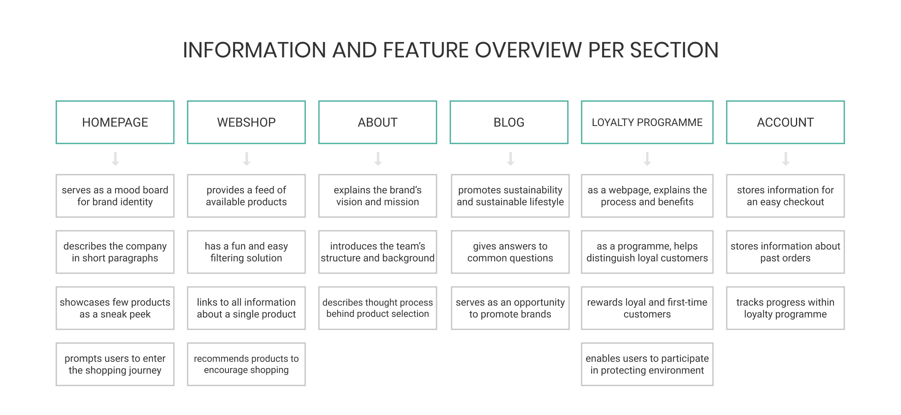

In the next few sections I will focus more on the most important sections and features, as well as additional features left to be 
implemented. The next step, described after this chapter, was choosing a database suitable to the project's needs and defining models.

### Web App Sections

1. **Navigation at the top** - fixed on the top so that the users are able to navigate themselves anytime. It consists of two HTML code snippets for better responsiveness handling.
1. **Homepage** - introduction to the app and brand identity. The idea is to give a short overview of what ECOSiO is, does and stands for through visual and textual content. Ideally, a user should be able to decide in a few seconds whether they feel connected to the brand identity and be a click away from the shopping feed.
1. **Webshop** - standard e-commerce feed of products with the option to sort products and filter them by category name and product tag. Every product can be added to the cart immediately and links to a product page where the user can read more about it.
1. **Product page** - a page dedicated to individual product. Consists of product description, ingredients and product tags that help with buying decision. At the bottom of the page, there are 3 more products shown to the customer. These 3 products are randomly selected from the same category the main product on the product page belongs to, for example 'Skincare' products.
1. **About page** - continues the information shortly provided on the homepage connected to the brand's vision, mission, team and principles regarding product selection for the webshop.
1. **Blog** - a section containing all the blog posts with the focus on sustainability, sustainable lifestyle and synthetic-free cosmetics.
1. **Blog post page** - a page dedicated to individual blog post. It consists of introductory paragraph and at least 2 but up to 3 textual sections. Since the idea is to use this section for showcasing brands ECOSiO is collaborating with as well, majority of the posts are written in collaboration with one of the brands the products in the webshop come from.
1. **Loyalty programme page** - continues the information shortly provided on the homepage connected to the loyalty programme. It describes the process, benefits and reasoning behind creating the programme.
1. **User account** - available to registered/logged in users with the purpose of tracking their loyalty programme status, order history and safely storing shipping details for a smooth checkout.
1. **Admin account** - available users with admin rights with the purpose of having access to the orders, user profiles, as well as product and blog inventory. Majority of the information is stored in [the Django admin site](https://docs.djangoproject.com/en/3.1/ref/contrib/admin/) but the users can also do common tasks such as adding, editing and deleting products or blog posts through ECOSiO's UI.
1. **Footer** - gives users the option to stay up to date with the app via links to social media profiles.

### Features and Django Apps

ECOSiO, [a Django project](https://docs.djangoproject.com/en/3.1/ref/applications/), consists of 8 Django applications listed below. 
As explained in Django's documentation - a Django application describes a Python package that provides some set of features. Applications may be 
reused in various projects.

* `homepage`
* `about`
* `blog`
* `loyalty_programme`
* `products`
* `cart`
* `checkout`
* `profiles`

Some features I've worked on are available across the Django project, while others are tied to a specific Django application. The following list 
of features is structured in a way that should help with understanding how the features are spread throughout the project.

**Navigation**
* always present on the top so that the users are able to navigate themselves anytime. It consists of **the top navigation** (a combination of a brand logo, search box, account related activities and the cart functionality) and **the main navigation** below it (for navigating throughout the main app sections).
* navigation links are compressed into a hamburger menu on mobile and tablet devices so that the main focus of the user is the shopping cart in the top right corner at all times, and not the navigation links.

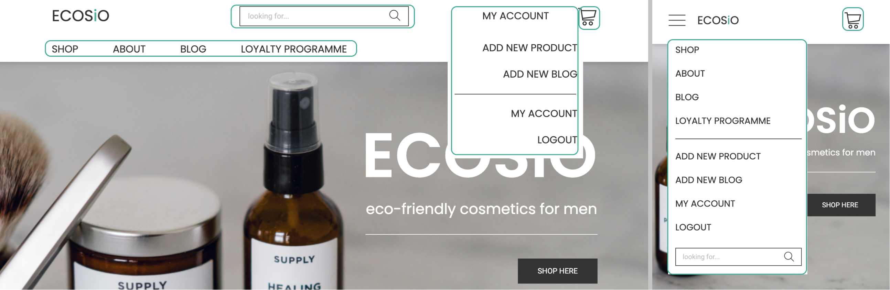

**Search functionality**
* as mentioned in the previous paragraph, a search box is part of the top navigation and is, therefore, accessible on all pages.
* it is collapsed under the hamburger menu on tablet and mobile devices as shown in the image above.
* it allows customers to enter keywords associated with the products they wish to purchase.
* the search results are displayed as a feed of products by using the page templates prepared for the `products` Django app (i.e. webshop).
* the search results show the number of products found for the search query, as well as inform the user if no products were found along with a CTA linked to the webshop's feed.

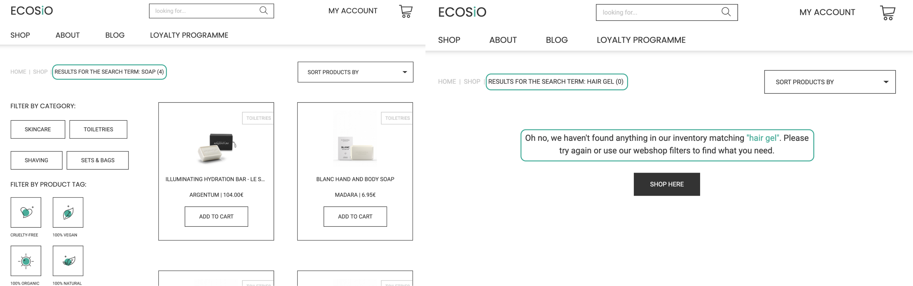

**Breadcrumbs**
* breadcrumbs are present throughout the `products` (i.e. webshop), `cart` and `checkout` Django apps and, additionally, throughout the `profiles` app.
* the purpose of this feature is to ease the navigation across ECOSiO only where navigation links might not be as helpful. Therefore, breadcrumbs don't appear on every webpage.

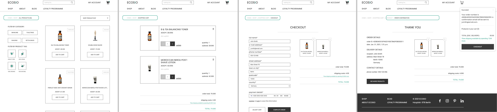

**Toasts**
* small snippets of messages divided into 4 main categories: `toast_success`, `toast_info`, `toast_warning` and `toast_error`.
* they appear on every page whenever a certain action has been done by the user.
* their purpose is to give feedback on the action a user has just performed, such as logging in, logging out, adding a product to the cart, updating the cart, editing a blog post, finishing the checkout process, adding too many products in the card, donating loyalty points, etc.
* it generally consists of the title based on the toast category with a matching text about the action. The `toast_success` toast additionally has cart information, that is hidden on `profiles` pages and for some other activities if nothing is added to the cart.

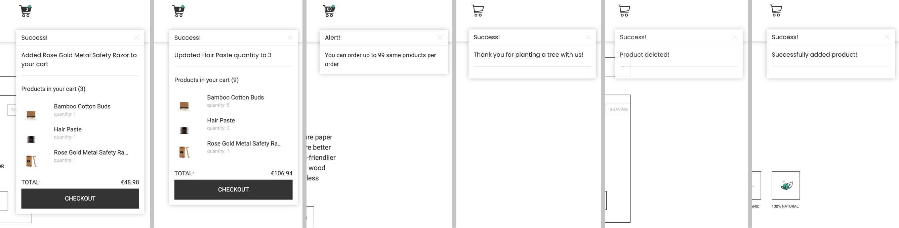

**Django-allauth feature**
* `django-allauth` is a Python package. As written in the [django-allauth docs](https://django-allauth.readthedocs.io/en/latest/), it is an "integrated set of Django applications addressing authentication, registration, account management as well as 3rd party (social) account authentication."
* it provides a set of features such as **signup**, **login**, **logout** and **password change**.
* after signing up, a verification e-mail is sent to the registered e-mail to confirm it. Once confirmed, the user can log in with their credentials and access the `profiles` app explained later below.
* the links to these features can be found in the navigation, under the **My Account** dropdown menu, as well as on the pages and throughout the web app (for example, registration prompt window on the `homepage`).

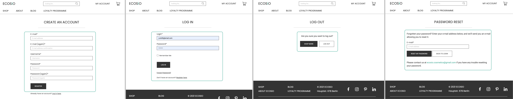

**Automatic e-mails**
* a gmail account **ecosio.cosmetics@gmail.com** has been created specifically for this project and used as a sender for all verification, reset and confirmation e-mails.
* for example, users receive an **order confirmation e-mail** after a purchase, **account verification e-mail** after the registration, **password reset e-mail** after requesting a password reset, etc.

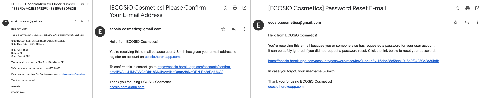

**Homepage app**
* `homepage` Django app mainly serving as an introduction to the brand and the marketplace
* the most prominent feature is the **registration prompt** displayed to the visitors that aren't logged in. It's fixed in the bottom right corner of the page and encourages the visitor to create an account by mentioning the 10% discount.
* another two features found on the homepage are the **popular products' gallery**, a feature for the admin team to set 3 products they want to showcase on the page, and the **curated shopping shortcuts** - links to prefiltered product by category. Both of these features mainly aim to be a sneak peek into the webshop so that it's easier for the users to decide if this might be something of their interest.

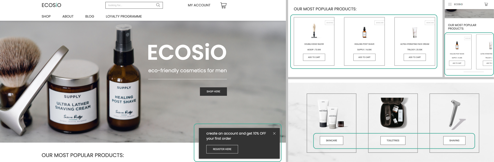

**About app**
* `about` Django app is one of the apps that are mostly relying on textual content.
* besides textual content, this app has a set of custom-made icons that summarise what ECOSiO is about and what it offers.

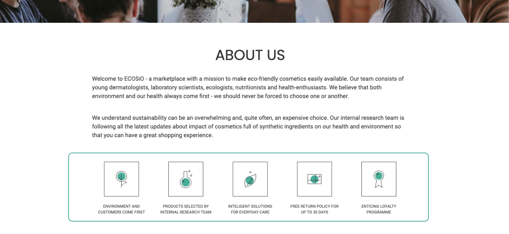

**Blog app**
* `blog` Django app mostly relies on textual content and can be split into 3 parts - **blog**, **blog posts** and **admin blog management activities**.
* this is a very simple blog feature whose purpose it to give customers more than just a shopping experience while navigating through ECOSiO.
* **blog** displays short introductions to all available **blog posts** and links to them.
* **blog posts** are individual blog entries, each tackling a topic related to sustainability and/or eco-friendly cosmetics. The topics are ideally chosen based on the questions coming from the users and aim to showcase one of the external brands ECOSiO has been working with. Through this brand partnership, ECOSiO gives a chance to the external brands for an additional marketing exposure.
* **admin blog management activities** include adding, editing and deleting blog entries. Users with admin rights can do that directly in the UI through forms. In case of deleting a blog post, a **modal** will open to double check if the user really wants to do this irreversible action.

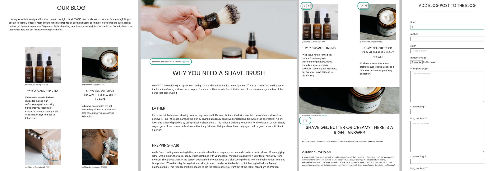

**Loyalty programme app**
* `loyalty_programme` Django app is also one of the apps that are mostly relying on textual content.
* this page explains how the programme actually works from user's perspective and what are the benefits of joining the programme, i.e. creating an account.
* the purpose of this feature is to offer an incentive for an account creation and maintain an on-going relationship with the loyal customers through rewards and other benefits.
* the logic of the programme is implemented under `profile` app since it's closely related to the `UserProfile` model. You can read more about it below, under `profiles` app.

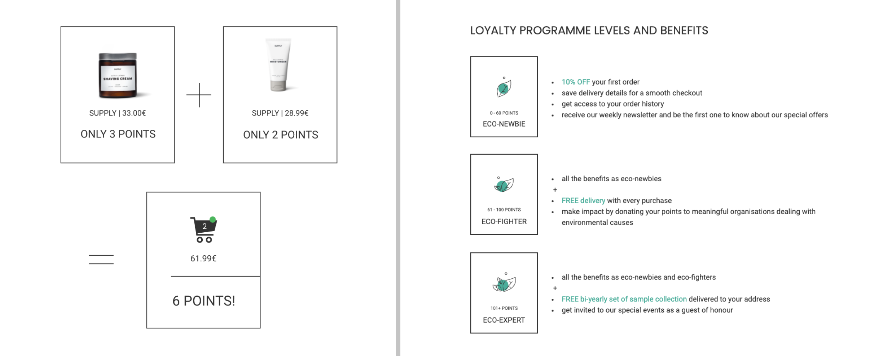

**Products app, i.e. Webshop**
* `products` Django app is where all the logic and templates connected to the product feed and individual products are.
* it can be divided into three main sections: **shop**, **product pages** and **admin product management activities**.
* **shop** is the main feed of products and this is where the majority of shopping journeys are expected to start. The shopping experience is enhanced by having a **dropdown for sorting products** (A-Z, Z-A, price low-high, price high-low), **category filters** (skincare, shaving, toiletries, sets & bags) and **product tag filters** that follow the user across the desktop version of the page, and a quick **add-to-cart** functionality for users that already know exactly what they want to buy.
* **product pages** are pages dedicated to each individual product. On these pages, the users can **read the product description, find ingredient list of the product** as well as **get additional product recommendations**. The product recommendations are random. The system selects 3 products from the same category the main product on the page belongs to and displays them at the bottom of the page. The recommended products turn into a scrollable gallery similar to the one on the homepage on mobile devices.
* additional feature on the product pages are **product tags** which help with deciding whether a product fits certain lifestyle or not. There are 5 tags in total - **eco-friendly** which is a tag all ECOSiO's products should have, and then **cruelty-free**, **100% vegan**, **100% organic** and **100% natural**. Users can also filter the products based on these tags in the **shop**.
* **admin product management activities** include adding, editing and deleting products. Users with admin rights can do that directly in the UI through forms. In case of deleting a product, a **modal** will open to double check if the user really wants to do this irreversible action.

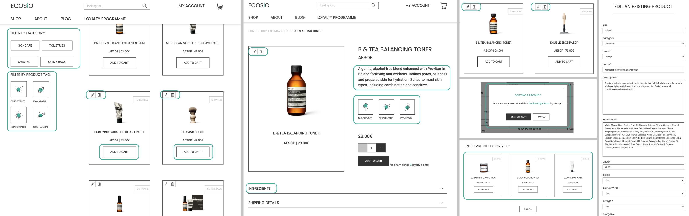

**Cart app**
* `cart` Django app is a standard e-commerce functionality which aids the checkout process.
* a cart is always present in the top right corner of the web app. **It turns black if it's full and shows the number of items added to the cart**.
* currently, a customer can put **up to 99 items of the same product** into the cart. If the user tries to add more items than that, the system alerts the user via toasts that 99 items is the maximum number of products that can be added.
* however, **adding products to the cart works differently on the product pages**. The users can define the exact amount of products they want to put into the cart as long as it's within the range (1 to 99). Since products can also be added from the homepage and the shopping feed, it might happen that the user has already added, for example, 10 items of the same product into the cart and now is trying to add 95 more products from the product page on top of that. The system will in that case check if the the sum of the current amount in the cart and the desired additional amount is higher than the allowed limit and **limit the amount of this same product in the cart to 99** if needed.
* similar to the limit of 99 same products per order, a customer can put **up to 150 items in total** into the cart. If the user tries to add more items than that, the system alerts the user via toasts that 150 items is the maximum number of products that can be added.
* after clicking on the cart in the top right corner, the user gets an overview of all the products put into the cart. The user can also modify the quantity of the added products as well as remove the products from the cart. Since removing products from the cart is not an irreversible action, I have decided not to have a modal here so that the focus remains on the checkout process.
* all the products in the cart are also linked to their product pages so that the users have an easy acces to them in case they wish to check them out again before entering the checkout process.
* the information provided on this page includes **usual product information, quantity per product, costs per product, order costs** (with 10% discount for first-time registered buyers), **shipping costs** (free for orders worth 120.00€ and above, as well as level 2 and level 3 loyal customers - otherwise 4.00€) and **total order costs**.
* if users try to access their empty carts, there will be a message displayed that nothing has been added yet and encourage them to go to the shop.

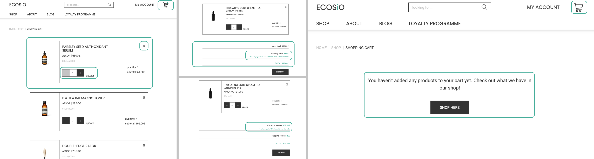

**Checkout app**
* `checkout` Django app is another standard e-commerce functionality which enables users to buy the products online from the webshop.
* in order to check out, the user is presented with a **form asking for the shipping and payment details** and with the **overview of the order**.
* users can easily go back to the cart and adjust it by clicking on the cart in the top right corner or breadcrumbs in the top left corner.
* all the discounts or benefits will also be visible and highlighted in the summary of the costs.
* both registered and anonymous users can shop at ECOSiO. Logged in users will have an option to **save their information** to the profile which should populate the form with relevant details for the next purchase.
* a webhook is implemented to the `checkout` so that the order is successfully processed in case the checkout process gets interrupted. Some reasons might be closing the browser too soon or losing internet connection.
* "payments" are handled through `stripe`. A test purchase can be made with the following details:
    * **credit card:** 4242 4242 4242 4242
    * **expiration date:** 04 / 24
    * **CVC:** 424
    * **ZIP:** 42424
* after the payment has been processed, the user is presented with the order summary on the **order confirmation page**.
* logged in buyers can also see their **order history** on the `profiles` pages.

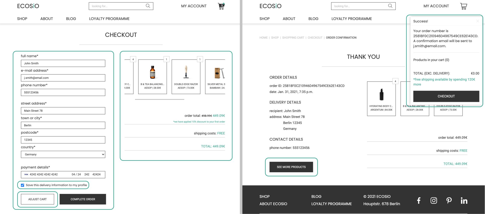

**Profiles app - and Loyalty Programme feature**
* `profiles` Django app is available to registered, authenticated users.
* it offers 3 features: **order history**, **saving shipping information** and **loyalty programme**.
* **order history** displays all previous orders per user account.
* **saving shipping information** is done through a form which can be edited anytime. This information is what populates the checkout form for the next orders and where shipping information saved during the checkout process is stored.
* **loyalty programme** is a feature that is partially implemented in the `profiles` app and partially in the `checkout` app. There are three levels users can achieve and unlocking each level brings new benefits. This is how the logic is distributed between the `checkout` and `profiles` app
    * `profiles` app: **stores loyalty points** under `UserProfile` model. It distinguishes between:
        - `earned_loyalty_points` - received after a purchase has been made. All the donated points get excluded from `earned_loyalty_points`.
        - `donated_loyalty_points` - sum of points donated by the user to one of the three causes.
            - `donated_loyalty_points_plant_tree` - points donated for planting a tree.
            - `donated_loyalty_points_recycle_plastic` - points donated to aid plastic recycling.
            - `donated_loyalty_points_clean_forest` - points donated to aid cleaning forests.
        - `total_loyalty_points` - all earned points ever received (earned and donated points together).
    * `checkout` app: **10% off the first purchase** for newly registered users. It is applied to users with no loyalty points. The free delivery threshold has been adjusted to follow the discounted order total.
    * `checkout` app: **1 loyalty point each time 10.00€ is spent**. Shipping costs are not included in the calculation.
    * `checkout` app: **free delivery for level 2 and level 3 users** is handled by overriding delivery costs if user has reached a certain number of points.
    * `profiles` app: **keeps track of users' loyalty statuses** by informing how many points are needed to unlock the next level, how many points have been donated to good causes, what are the benefits currently available to the users and which ones will be unlocked in the future.
    * `profiles` app: **registration for attending ECOSiO's live event**. Level 3 customers can register for an event that ECOSiO holds once a year. This feature is suppose to help with strengthening the community built around the brand and it's a chance for customers to meet the team and like-minded people.

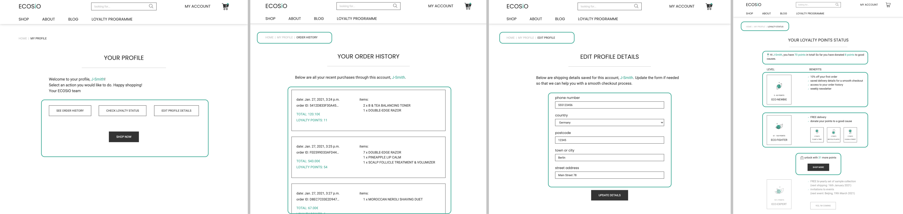

### Features Left to Implement

Working on this project has been an amazing experience and I truly wish I had more time to implement several other features. Here are some
I had in mind while working on the project:

**Animations**
* the project's UI could be further enhanced by animations.
* one example could be animated leaves coming from the add-to-cart CTA after clicking it.

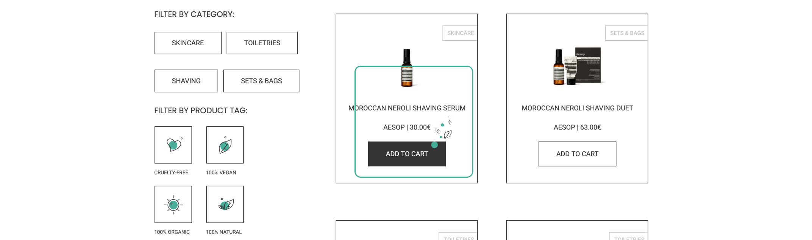

**Contact page**
* at the moment, ECOSiO's e-mail is displayed whenever users do an action that they might need an additional assistance with.
* it would be helpful to have a contact form sent directly to the admins by e-mail in case there are additional inquiries.

**Save for later**
* a feature that allows authenticated users to save items for later.
* every product in the feed and on product pages would have a heart-shaped icon which would add the product on a list. The list could be accessed on one of the `profiles` pages, where users can remove the items from the list as well.

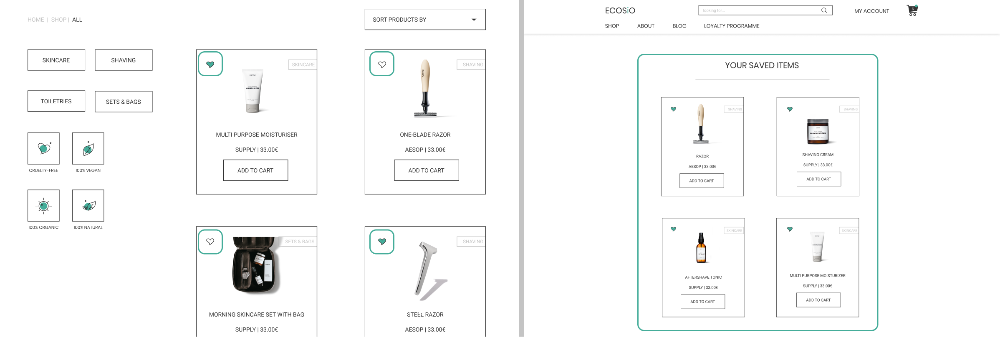

**Cart keeps items after logging out**
* a simple feature which would store what the user had in the cart before logging out.
* in combination with `toasts`, it could act as a reminder of what the user's last shopping-related action was.
* the main goal of this feature is to increase the conversion rate.

**Comments, voting on blog posts and products in blog posts**
* comments are a standard feature that blogs normally have so it would be great to implement it here as well. It would allow authenticated users exchange ideas on certain topics and connect.
* additional feature would be a simple voting structure to indicate how many people have liked a certain piece of content.
* lastly, it would be great to be able to feature some of the products in the blog posts to increase the conversion rate.

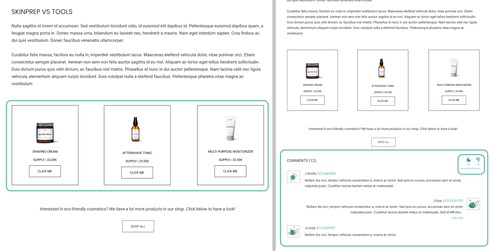

**Product reviews**
* another standard e-commerce features that helps users with buying decision.
* the idea would be to implement ratings and product reviews on product pages.

**Better feedback on loyalty points donations**
* this feature is imagined to give a better feedback on the donated points. At the moment a toast alerts the users that the points have been donated to a chosen cause.
* ideally, a modal would pop up and, for example, tell the user exactly where the tree is planning to be planted or which forest will be cleaned by the help of the donated points.

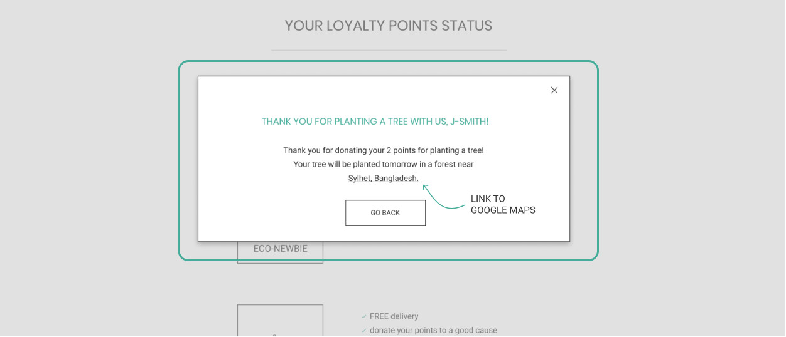

**Recommendation system**
* with some of these features implemented, it would be great to have a proper recommendation system in place. The system could be based on which products have been clicked on the most, bought the most, which brands are they from, which category are they from, which products have been saved the most, etc.
* this recommendation system could help content writers with choosing topics to write about, which products to showcase in blog posts, and additionally which products should be recommended on the product pages (at the moment they are randomly selected).
* thinking further, once a proper CRM system has been built, a weekly newsletter could be sent to the users with personalised products recommendations.

### Wireframes

The wireframes linked below are only some that I've made for this project. They were created with [Figma](https://www.figma.com/).

Desktop wireframes:
* [homepage](https://raw.githubusercontent.com/valentina-b/ecosio-eco-friendly-cosmetics/master/readme-files/wireframes/dsk/wireframe-dsk-homepage.png)
* [about page](https://raw.githubusercontent.com/valentina-b/ecosio-eco-friendly-cosmetics/master/readme-files/wireframes/dsk/wireframe-dsk-about.png)
* [loyalty programme page](https://raw.githubusercontent.com/valentina-b/ecosio-eco-friendly-cosmetics/master/readme-files/wireframes/dsk/wireframe-dsk-loyalty-programme.png)
* [blog](https://raw.githubusercontent.com/valentina-b/ecosio-eco-friendly-cosmetics/master/readme-files/wireframes/dsk/wireframe-dsk-blog.png)
* [webshop](https://raw.githubusercontent.com/valentina-b/ecosio-eco-friendly-cosmetics/master/readme-files/wireframes/dsk/wireframe-dsk-webshop.png)
* [product page](https://raw.githubusercontent.com/valentina-b/ecosio-eco-friendly-cosmetics/master/readme-files/wireframes/dsk/wireframe-dsk-product-page.png)
* [cart](https://raw.githubusercontent.com/valentina-b/ecosio-eco-friendly-cosmetics/master/readme-files/wireframes/dsk/wireframe-dsk-cart.png)
* [checkout](https://raw.githubusercontent.com/valentina-b/ecosio-eco-friendly-cosmetics/master/readme-files/wireframes/dsk/wireframe-dsk-checkout.png)
* [user's loyalty points status](https://raw.githubusercontent.com/valentina-b/ecosio-eco-friendly-cosmetics/master/readme-files/wireframes/dsk/wireframe-dsk-loyalty-status.png)
* [folder with all desktop wireframes](https://github.com/valentina-b/ecosio-eco-friendly-cosmetics/tree/master/readme-files/wireframes/dsk)

Tablet wireframes:
* [homepage](https://raw.githubusercontent.com/valentina-b/ecosio-eco-friendly-cosmetics/master/readme-files/wireframes/tab/wireframe-tab-homepage.png)
* [about page](https://raw.githubusercontent.com/valentina-b/ecosio-eco-friendly-cosmetics/master/readme-files/wireframes/tab/wireframe-tab-about.png)
* [loyalty programme page](https://raw.githubusercontent.com/valentina-b/ecosio-eco-friendly-cosmetics/master/readme-files/wireframes/tab/wireframe-tab-loyalty-programme.png)
* [blog](https://raw.githubusercontent.com/valentina-b/ecosio-eco-friendly-cosmetics/master/readme-files/wireframes/tab/wireframe-tab-blog.png)
* [webshop](https://raw.githubusercontent.com/valentina-b/ecosio-eco-friendly-cosmetics/master/readme-files/wireframes/tab/wireframe-tab-webshop.png)
* [product page](https://raw.githubusercontent.com/valentina-b/ecosio-eco-friendly-cosmetics/master/readme-files/wireframes/tab/wireframe-tab-product-page.png)
* [cart](https://raw.githubusercontent.com/valentina-b/ecosio-eco-friendly-cosmetics/master/readme-files/wireframes/tab/wireframe-tab-cart.png)
* [checkout](https://raw.githubusercontent.com/valentina-b/ecosio-eco-friendly-cosmetics/master/readme-files/wireframes/tab/wireframe-tab-checkout.png)
* [user's loyalty points status](https://raw.githubusercontent.com/valentina-b/ecosio-eco-friendly-cosmetics/master/readme-files/wireframes/tab/wireframe-tab-loyalty-status.png)
* [folder with all tablet wireframes](https://github.com/valentina-b/ecosio-eco-friendly-cosmetics/tree/master/readme-files/wireframes/tab)

Mobile wireframes:
* [homepage](https://raw.githubusercontent.com/valentina-b/ecosio-eco-friendly-cosmetics/master/readme-files/wireframes/mob/wireframe-mob-homepage.png)
* [about page](https://raw.githubusercontent.com/valentina-b/ecosio-eco-friendly-cosmetics/master/readme-files/wireframes/mob/wireframe-mob-about.png)
* [loyalty programme page](https://raw.githubusercontent.com/valentina-b/ecosio-eco-friendly-cosmetics/master/readme-files/wireframes/mob/wireframe-mob-loyalty-programme.png)
* [blog](https://raw.githubusercontent.com/valentina-b/ecosio-eco-friendly-cosmetics/master/readme-files/wireframes/mob/wireframe-mob-blog.png)
* [webshop](https://raw.githubusercontent.com/valentina-b/ecosio-eco-friendly-cosmetics/master/readme-files/wireframes/mob/wireframe-mob-webshop.png)
* [product page](https://raw.githubusercontent.com/valentina-b/ecosio-eco-friendly-cosmetics/master/readme-files/wireframes/mob/wireframe-mob-product-page.png)
* [cart](https://raw.githubusercontent.com/valentina-b/ecosio-eco-friendly-cosmetics/master/readme-files/wireframes/mob/wireframe-mob-cart.png)
* [checkout](https://raw.githubusercontent.com/valentina-b/ecosio-eco-friendly-cosmetics/master/readme-files/wireframes/mob/wireframe-mob-checkout.png)
* [user's loyalty points status](https://raw.githubusercontent.com/valentina-b/ecosio-eco-friendly-cosmetics/master/readme-files/wireframes/mob/wireframe-mob-loyalty-status.png)
* [folder with all mobile wireframes](https://github.com/valentina-b/ecosio-eco-friendly-cosmetics/tree/master/readme-files/wireframes/mob)

<div align="right">
    <a href="#table-of-contents"> ⇧ Back To Top </a>
</div>

## Information Architecture

As Django works with SQL databases by default, I was using SQLite in development. Heroku, however, provides a PostgreSQL database 
for deployment.

### Data Models

**User Model**

Django `User` model is a part of Django’s authentication system `django.contrib.auth.models`. You can read more about its fields, attributes,
methods, etc. [here](https://docs.djangoproject.com/en/3.0/ref/contrib/auth/).

**Profiles App**

`UserProfile` model

| **Name**   | **Database Key**   | **Field Type**   | **Type Validation**   |
| ---------- | ------------------ | ---------------- | --------------------- |
| User | user | OneToOneField 'User' | on_delete=models.CASCADE |
| Default Phone Number | default_phone_number | CharField | max_length=20, null=True, blank=True |
| Default Country | default_country | CountryField | blank_label='country', null=True, blank=True |
| Default Postcode | default_postcode | CharField | max_length=20, null=True, blank=True |
| Default Town or City | default_town_or_city | CharField | max_length=40, null=True, blank=True |
| Default Street Address | default_street_address | CharField | max_length=80, null=True, blank=True |
| Earned Loyalty Points | earned_loyalty_points | DecimalField | max_digits=10, decimal_places=0, null=False, default=0 |
| Donated Loyalty Points | donated_loyalty_points | DecimalField | max_digits=10, decimal_places=0, null=False, default=0 |
| Donated Loyalty Points Plant Tree | donated_loyalty_points_plant_tree | DecimalField | max_digits=10, decimal_places=0, null=False, default=0 |
| Donated Loyalty Points Recycle Plastic | donated_loyalty_points_recycle_plastic | DecimalField | max_digits=10, decimal_places=0, null=False, default=0 |
| Donated Loyalty Points Clean Forest | donated_loyalty_points_clean_forest | DecimalField | max_digits=10, decimal_places=0, null=False, default=0 |
| Total Loyalty Points | total_loyalty_points | DecimalField | max_digits=10, decimal_places=0, null=False, default=0 |
| Going to Event | going_to_event | BooleanField | default=False |

**Products App**

`Category` model

| **Name**   | **Database Key**   | **Field Type**   | **Type Validation**   |
| ---------- | ------------------ | ---------------- | --------------------- |
| Name | name | CharField | max_length=254 |
| Friendly Name | friendly_name | CharField | max_length=254, null=True, blank=True |

`Brand` model

| **Name**   | **Database Key**   | **Field Type**   | **Type Validation**   |
| ---------- | ------------------ | ---------------- | --------------------- |
| Name | name | CharField | max_length=254 |
| Friendly Name | friendly_name | CharField | max_length=254, null=True, blank=True |
| Short Name | short_name | CharField | max_length=25, null=True, blank=True |

`Product` model

| **Name**   | **Database Key**   | **Field Type**   | **Type Validation**   |
| ---------- | ------------------ | ---------------- | --------------------- |
| SKU | sku | CharField | max_length=254, null=True, blank=True |
| Category | category | ForeignKey 'Category' | null=True, blank=True, on_delete=models.SET_NULL |
| Brand | brand | ForeignKey 'Brand' | null=True, blank=True, on_delete=models.SET_NULL |
| Name | name | CharField | max_length=55 |
| Description | description | TextField | max_length=375 |
| Ingredients | ingredients | TextField | max_length=4000 |
| Price | price | DecimalField | max_digits=6, decimal_places=2 |
| Is Eco | is_eco | BooleanFieldBooleanField | default=True, null=True, blank=True |
| Is Cruelty-Free | is_crueltyfree | BooleanField | default=True, null=True, blank=True |
| Is Vegan | is_vegan | BooleanField | default=True, null=True, blank=True |
| Is Organic | is_organic | BooleanField | default=True, null=True, blank=True |
| Is Natural | is_natural | BooleanField | default=True, null=True, blank=True |
| Image | image | ImageField | null=True, blank=True |

**Checkout App**

`Order` model

| **Name**   | **Database Key**   | **Field Type**   | **Type Validation**   |
| ---------- | ------------------ | ---------------- | --------------------- |
| Order Number | order_number | CharField | max_length=32, null=False, editable=False |
| User Profile | user_profile | ForeignKey 'UserProfile' | on_delete=models.SET_NULL, null=True, blank=True, related_name='orders' |
| Full Name | full_name | CharField | max_length=50, null=False, blank=False |
| E-mail | email | EmailField | max_length=254, null=False, blank=False |
| Phone Number | phone_number | CharField | max_length=20, null=False, blank=False |
| Country | country | CountryField | blank_label='(select your country)', null=False, blank=False |
| Town or City | town_or_city | CharField | (max_length=40, null=False, blank=False |
| Postcode | postcode | CharField | max_length=20, null=False, blank=False |
| Street Address | street_address | CharField | max_length=80, null=False, blank=False |
| Date | date | DateTimeField | auto_now_add=True |
| Delivery Cost | delivery_cost | DecimalField | max_digits=6, decimal_places=2, null=False, default=0 |
| Order Total | order_total | DecimalField | max_digits=10, decimal_places=2, null=False, default=0 |
| Order Total | grand_total | DecimalField | max_digits=10, decimal_places=2, null=False, default=0 |
| Original Cart | original_cart | TextField | null=False, blank=False, default='' |
| Stripe PID | stripe_pid | CharField | max_length=254, null=False, blank=False |
| Loyalty Points | loyalty_points | DecimalField | max_digits=10, decimal_places=0, null=False, default=0 |

`OrderLineItem` model

| **Name**   | **Database Key**   | **Field Type**   | **Type Validation**   |
| ---------- | ------------------ | ---------------- | --------------------- |
| Order | order | ForeignKey 'Order' | null=False, blank=False, on_delete=models.CASCADE, related_name='lineitems' |
| Product | product | ForeignKey 'Product' | null=False, blank=False, on_delete=models.CASCADE |
| Quantity | quantity | IntegerField | null=False, blank=False, default=0 |
| Line Item Total | lineitem_total | DecimalField | max_digits=6, decimal_places=2, null=False, blank=False, editable=False |

**Blog App**

`Order` model

| **Name**   | **Database Key**   | **Field Type**   | **Type Validation**   |
| ---------- | ------------------ | ---------------- | --------------------- |
| Published Date | published_date | DateTimeField | auto_now_add=True |
| Title | title | CharField | max_length=55 |
| Author | author | CharField | max_length=55, null=True, blank=True |
| Slug | slug | SlugField | max_length=200, unique=True |
| Header Image | header_image | ImageField |  |
| Intro Paragraph | intro_paragraph | TextField | validators=[MinLengthValidator(100)], max_length=400 |
| Subheading 1 | subheading_1 | CharField | max_length=55 |
| Blog Content 1 | blog_content_1 | TextField | validators=[MinLengthValidator(250)] |
| Subheading 2 | subheading_2 | CharField | max_length=55 |
| Blog Content 2 | blog_content_2 | TextField | validators=[MinLengthValidator(250)] |
| Subheading 3 | subheading_3 | CharField | max_length=55, null=True, blank=True |
| Blog Content 3 | blog_content_3 | TextField | validators=[MinLengthValidator(250)], null=True, blank=True |

<div align="right">
    <a href="#table-of-contents"> ⇧ Back To Top </a>
</div>

## Graphic Design and Brand Elements

Based on the audience research, it has become clear early on that the project will require more efforts when it comes to the brand identity
and visual design. Since the target audience identifies both sustainability and cosmetics with women, it was crucial to create a brand the
users are comfortable with.

My approach to design started with research as well. I had to be aware of what kind of product packaging and web design guidelines
competitors and cosmetic companies are following. Since my marketplace is going to have those products, my design had to match them
well - and that too, not match well with only one of those brands but all of them.

Two brands were a huge inspiration for my design - [Supply](https://supply.co/) and [Aesop](https://www.aesop.com/us/). Most of the
product selection is coming from these two brands and, even though Aesop isn't just for men, I think they are both such a great example of
elegant minimalist design style. The fact that majority of the brands have product images without background or with white background was a
big help as it allowed me to focus more on creating ECOSiO's visual design rather than adjust it to the products.

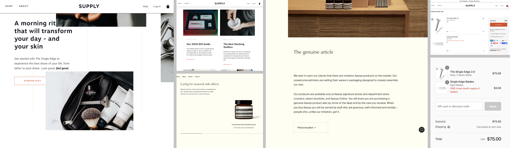

### Fonts

I have come across [Poppins](https://fonts.google.com/specimen/Poppins) by browsing through Google fonts. I was looking for a font that would
be similar to Supply's and Aesop's primary fonts, which both seem to be characterised by having wide letters. Poppins stood out not only 
because it fulfilled this requirement but also because it belongs to the sans serif font type, which is a common web developer's choice 
for titles due to its high readability level and simplicity. I've paired Poppins with [Roboto](https://fonts.google.com/specimen/Poppins) 
which was one of the suggestions from Google fonts.

### Colours

My colour selection for this project was very simple. I've chosen a dark shade of gray (#333333) for the textual content and used it as the
primary accent colour for the CTAs and borders. As a contrast to it, plain white colour (#FFFFFF) has been chosen. Using a very light gray
colour (i.e. slightly tinted white) would create problems when it comes to product imagery. Their backgrounds are either transparent or
white so choosing any other shade besides pure white might make those image backgrounds stand out and create inconsistencies 
throughout the product feed, product pages, etc.

Two more shades of gray have been chosen for different purposes. The darker shade of gray (#C4C4C4) is mostly used for the form placeholder
copy, muted copy and text that shouldn't be accentuated (for example, category labels on product cards). The lighter shade of gray (#F5F5F5)
is used as a background colour, mostly for the paragraphs to separate them as sections but in such combination so that the contrast
between the text (#333333) and the background (#F5F5F5) is still high enough.

The last colour that I've added is a shade of green (#45AD9A). I was looking for a shade that would be closer to the blue than to the yellow 
colour to stay away from warm colours, which are often associated with femininity. I also thought this shade is a great mixture of green,
the colour of nature, and blue, the colour normally associated with calmness. This is the only colour outside of the black and white spectrum
and is, therefore, used as accent colour at times - such as for the links, important notes, form fields' outline, etc. - and icons.

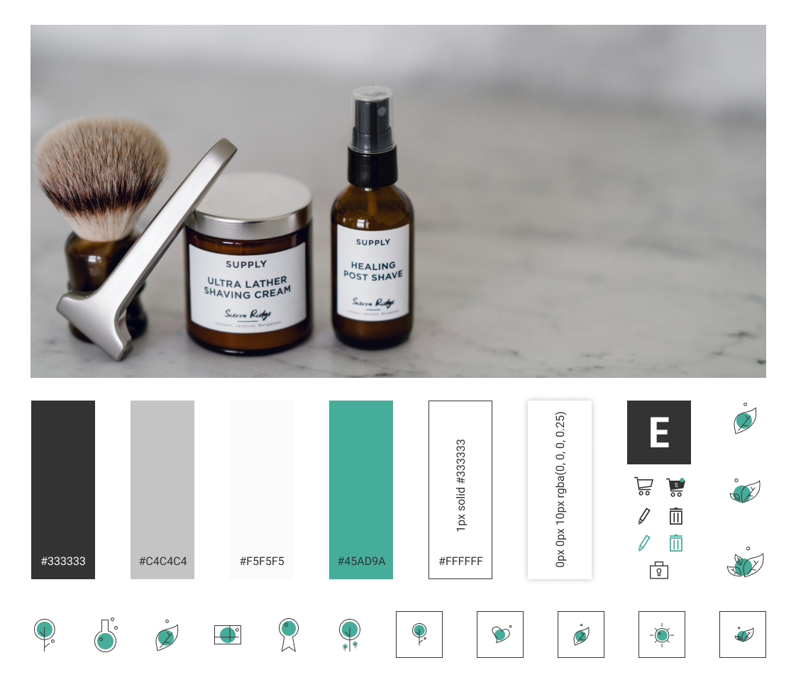

### Icons

As briefly mentioned in the previous paragraph, the icons often combine the dark shade of gray (#333333) and green colour (#45AD9A).
Their design is minimalistic and relies on geometric shapes. All icons, apart from the social media logos, have been custom-designed 
for this project by me.

### Images

[Supply](https://supply.co/) has been the biggest source of inspiration for the visual aspect of this project. I have come across this brand by
searching for images suitable for the project on [Unsplash](https://unsplash.com/). Supply have their own [Unsplash account](https://unsplash.com/@supply)
and contribute to open source imagery with images from their own photoshoots. I have additionally taken other images with similar style
from Unsplash and Supply's website.

Finding images that would fit the colour palette and focus more on gray shades rather than being colourful and vibrant was quite a difficult task
in general.

### Visual Style

Once the font, colour palette and images were selected, I focused on the design of the elements. I wanted the web app to look professional, 
minimalistic and modern.

Since my goal was to create a product that would resonate with male audience, I've decided that it would be the best to keep the page elements
such as buttons, input fields, product cards, etc. with sharp edges. On the other hand, to achieve a modern look which would ease this 
sharpness and act as a border between two elements that don't have a visual border between them (such as the white navigation and white background),
a light and often barely noticeable shadow has been included.

Visual identity is in general heavily relying on reduced colour palette, sharp-edged elements and borders. There are no additional decorations
apart from occasional simple lines that help out with breaking down the sections for easier information grasping.

<div align="right">
    <a href="#table-of-contents"> ⇧ Back To Top </a>
</div>

## Technologies Used

This project mostly focuses on the following technologies:

1. [HTML](https://en.wikipedia.org/wiki/HTML) - for creating the layout and the structure of the website
1. [CSS](https://en.wikipedia.org/wiki/Cascading_Style_Sheets) - for styling the website’s HTML code
1. [Bootstrap](https://getbootstrap.com/) - for additional styling and adding responsiveness to the website
1. [JavaScript](https://en.wikipedia.org/wiki/JavaScript) and [jQuery](https://jquery.com/) - for frontend interactivity
1. [Python](https://en.wikipedia.org/wiki/Python_(programming_language)) - for backed logic and structure
1. [Jinja](https://jinja.palletsprojects.com/en/2.11.x/) - for displaying backend information in frontend
1. [Django](https://www.djangoproject.com/) - high-level Python web framework
1. [Heroku](https://www.heroku.com/) - cloud platform where the web app is deployed
1. [SQLite](https://www.sqlite.org/index.html) - default Django's database used in development
1. [PostgreSQL](https://www.postgresql.org/) - production database through Heroku
1. [AWS S3](https://aws.amazon.com/) - for hosting media and static files on cloud
1. [Git](https://git-scm.com/) - for version control
1. [Stripe](https://stripe.com/en-gb-de) - for managing (test) transactions

Technology used that is connected to [Bootstrap](https://getbootstrap.com/) for some components to function properly:

1. [jQuery](https://jquery.com/)
1. [Popper.js](https://popper.js.org/)
1. [JavaScript](https://en.wikipedia.org/wiki/JavaScript)

Additionally, I have also used the following platforms to help me shape the website and the brand:

1. [Gitpod](https://gitpod.io/) - for writing, editing and live previewing the code during the creation process
1. [GitHub](https://github.com/) - for hosting the project's repository
1. [TinyPNG](https://tinypng.com/) - for compressing the images so that the website can load faster
1. [Google Fonts](https://fonts.google.com/) - for selecting the fonts
1. [Figma](https://www.figma.com/) - for creating wireframes, web designs and icons
1. [Favicon](https://favicon.io/) - for creating browser tab icons
1. [Autoprefixer](https://autoprefixer.github.io/) - for solving cross-browser CSS issues

<div align="right">
    <a href="#table-of-contents"> ⇧ Back To Top </a>
</div>

## Testing and Defensive Design

More about **Testing and Defensive Design** can be found in the [TESTING.md](https://github.com/valentina-b/ecosio-eco-friendly-cosmetics/blob/master/TESTING.md) file.

<div align="right">
    <a href="#table-of-contents"> ⇧ Back To Top </a>
</div>

## Deployment

ECOSiO was developed with [Gitpod](https://gitpod.io/) IDE. [Git](https://git-scm.com/) was used for verion control and [GitHub](https://github.com/)
for hosting the project's repository. The project is hosted on [Heroku](https://www.heroku.com/) while [AWS S3](https://aws.amazon.com/)
is hosting static files and images.

### Local Deployment

To run this project locally (on your own IDE), make sure you:
* have an IDE of your choice ready (such as [Gitpod](https://gitpod.io/))
* have the following installed:
    * [Git](https://gist.github.com/derhuerst/1b15ff4652a867391f03)
    * [Python3](https://www.python.org/downloads/)
    * [pip](https://pip.pypa.io/en/stable/installing/)

Additionally you will need (free) accounts of the following services:
* [Gmail](https://www.google.com/gmail/)
* [Stripe](https://stripe.com/en-gb-de)
* [AWS S3](https://aws.amazon.com/)

**Instructions**

1. Clone this repository
* after installing requirements mentioned earlier, clone the project by pasting the following command into the terminal:
    * `git clone https://github.com/valentina-b/ecosio-eco-friendly-cosmetics`
* alternatively, you can go to [ECOSiO's repository](https://github.com/valentina-b/ecosio-eco-friendly-cosmetics), click the green 'Code' button and 'Download ZIP option in the dropdown menu to save the files on your machine
* for more information please visit [GitHub's help pages](https://help.github.com/en/github/creating-cloning-and-archiving-repositories/cloning-a-repository)

2. Set up environment variables
* create `.env` file in the root directory
* add `.env` to `.gitignore` file in the root directory
* add the following environment variables to `.env`:
```bash 
import os
os.environ["DEVELOPMENT"] = "True"
os.environ["SECRET_KEY"] = "<Your Key>"
os.environ["STRIPE_PUBLIC_KEY"] = "<Your Key>"
os.environ["STRIPE_SECRET_KEY"] = "<Your Key>"
os.environ["STRIPE_WH_SECRET"] = "<Your Key>"
```
* if you're working with GitPod, you can set these variables in the 'Settings'
    * click your profile icon in the top right corner in Gitpod
    * click 'Open Workspaces'
    * again click your profile icon in the top right corner
    * click 'Settings' option in the dropdown menu
    * click 'Add Variable' button to add a variable

3. Install requirements from `requirements.txt` file
* paste the following command into the terminal: 
    * `pip3 install -r requirements.txt`

4. Migrate the models to create a database
* paste the following commands into the terminal:
    * `python3 manage.py makemigrations`
    * `python3 manage.py migrate`

5. Load the data fixtures in this exact order
* paste the following commands into the terminal:
    * `python3 manage.py loaddata categories`
    * `python3 manage.py loaddata brands`
    * `python3 manage.py loaddata products`
    * `python3 manage.py loaddata blogs`

6. Create a superuser (user with admin rights)
* paste the following command into the terminal:
    * `python3 manage.py createsuperuser`
* enter an e-mail, username and password for the superuser

7. Run the web app
* paste the following command into the terminal:
    * `python3 manage.py runserver`

8. Log into Django admin
* after running the web app, add `/admin` at the end of the URL and log in with the superuser credentials from the previous step

### Heroku Deployment

1. Create a `requirements.txt` file
* paste the following command into the terminal:
    * `pip freeze > requirements.txt`

2. Create a `Procfile`
* create a `Procfile` in the root directory
* add the following code into it:
    * `web: gunicorn ecosio.wsgi:application`

3. Push the code to GitHub
* paste the following commands into the terminal:
    * `git add .`
    * `git commit -m "<your commit note>"`
    * `git push`

4. Create a new app on Heroku
* create a new app (click on 'New' > 'Create new app')
* give it a unique name
* set region closest to you

5. Set Heroku Postgres
* go to 'Resources' tab
* search for 'Heroku Postgres'
* select the 'Hobby Dev' free plan

6. Set config variables in Heroku

| **Key**   | **Value**   |
| --------- | ----------- |
| AWS_ACCESS_KEY_ID | < your AWS access key ID > |
| AWS_SECRET_ACCESS_KEY | < your AWS secret access key > |
| DATABASE_URL | < your postgres database URL > |
| EMAIL_HOST_PASS | < 16-character password from Gmail > |
| EMAIL_HOST_USER | < your Gmail > |
| SECRET_KEY | < your secret key > |
| STRIPE_PUBLIC_KEY | < your stripe public key > |
| STRIPE_SECRET_KEY | < your stripe secret key > |
| STRIPE_WH_SECRET | < your stripe webhook key > |
| USE_AWS | True |

7. Set up new database
* in `settings.py`:
    * import dj_database_url
    * comment out `DATABASES` (temporarily, **do not commit/push this code to GitHub until instructed so**)
    * add the following code:
```bash
DATABASES = {
        'default': dj_database_url.parse("<your Postrgres database URL>")
    }
```

8. Migrate the models to Postgres database
* paste the following commands into the terminal:
    * `python3 manage.py makemigrations`
    * `python3 manage.py migrate`

9. Load the data fixtures in this exact order
* paste the following commands into the terminal:
    * `python3 manage.py loaddata categories`
    * `python3 manage.py loaddata brands`
    * `python3 manage.py loaddata products`
    * `python3 manage.py loaddata blogs`

10. Create a superuser (user with admin rights)
* paste the following command into the terminal:
    * `python3 manage.py createsuperuser`
* enter an e-mail, username and password for the superuser

11. Correct the `settings.py` database from step 7.
* uncomment the `DATABASES`
* remove the code added in step 7.

12. Add the hostname of Heroku app to allowed EMAIL_HOST_USER
* in `settings.py`:
    * add the following code:
```bash
ALLOWED_HOSTS = ['<your Heroku app URL>', 'localhost]
```

13. Push the code to GitHub
* paste the following commands into the terminal:
    * `git add .`
    * `git commit -m "<your commit note>"`
    * `git push`

14. Set up automatic deployment to Heroku (**optional**)
* in Heroku go to 'Deploy' > 'Deployment method' > 'Connect to GitHub'
* search for your repository and click on it
* go to 'Automatic Deployment' > click 'Enable Automatic Deploys'

15. Test automatic deployment
* your code should be automatically deployed to Heroku after pushing your code

### Hosting Files with AWS

In order to host static files and images with AWS, you will need to create an [AWS account](https://aws.amazon.com/).
Additionally, you have to create:
* an AWS S3 Bucket
* a Bucket Policy
* a Group
* an Access Policy
* a User

It is a lengthy process but you can learn more about Amazon Simple Storage Service [here](https://docs.aws.amazon.com/AmazonS3/latest/gsg/GetStartedWithS3.html).
After that, you will need to [connect Django to S3](https://django-storages.readthedocs.io/en/latest/backends/amazon-S3.html).

### Sending E-mails through Gmail

In order to send automatic e-mails with Django, you need a Gmail account.
* go to the account settings
* go to the 'Other Google Account Settings'
* go to the 'Security' tab
* turn on 2-step verification
* go back to 'Security' tab and click on 'App passwords'
* select 'Mail' in the app dropdown
* select 'Other' in the device dropdown
* copy the 16-character password
* go to Heroku and put it under `EMAIL_HOST_PASS` config variable
* put the Gmail e-mail under the `EMAIL_HOST_USER` config var

<div align="right">
    <a href="#table-of-contents"> ⇧ Back To Top </a>
</div>

## Credits

### Content

* product specifications were taken from their brands' websites (title, description, ingredient list, brand name). Only in a few cases I had to modify the text (no space after comma, title not capitalised, title too long etc.) but I did my best to stay as close as possible to the original specifications.
* blog posts copy was taken from their brands' websites. Brand name is put under the `author` field. In some cases I had to adjust titles and trim the copy to fit the layout better.
* the rest of the textual content for this web app is original, written by me.

### Media

* the photos for paragraphs and headers were downloaded from [Unsplash](https://unsplash.com/). [Supply's Unsplash account](https://unsplash.com/@supply) has been particularly helpful - it's so amazing that the company has decided to contribute to Unsplash with their beautiful, high-quality images!
* the product images are taken from their brands' websites. Only in a few cases I've found products on other marketplaces, however, I have registered them in the inventory under their matching brand name.
* social media icons in the footer were downloaded from [Flaticon](https://www.flaticon.com/).
* all other icons were created by me in [Figma](https://www.figma.com/).
* the README hero image was taken with the help of [Ami.ResponsiveDesign](http://ami.responsivedesign.is/).

### Inspiration Sources

* the biggest two inspiration sources were [Supply](https://supply.co/) and [Aesop](https://www.aesop.com/us/).
* an important part of my design and research were also [Amazon](https://www.amazon.com/) and [Mankind](https://www.mankind.co.uk/).

### Coding Sources

* helped me understand [webhooks](https://zapier.com/blog/what-are-webhooks/).
* helped me understand [how to style `select` tags with CSS](https://stackoverflow.com/questions/14218307/select-arrow-style-change).
* helped me understand [how to remove glossy effect for `select` tags in Safari](https://stackoverflow.com/questions/7638677/how-can-i-remove-the-gloss-on-a-select-element-in-safari-on-mac).

### Acknowledgments

* Thank you [CodeInstitute's](https://codeinstitute.net/) Tutors and Slack community for being there for annoying bug-related questions!
* Last but not least, a huge and warm thank you to my mentor [Dick Vlaanderen](https://github.com/dickvla) - not just for being such an incredible source of encouragement and great ideas for this project but for being there throughout all of my projects and coding journey at CodeInstitute. Thank you for all your support and kind words - working on this project wouldn't have been fun and such a wonderful experience without you!

<div align="right">
    <a href="#table-of-contents"> ⇧ Back To Top </a>
</div>