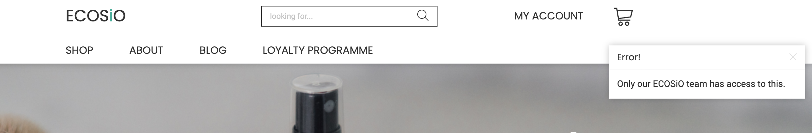
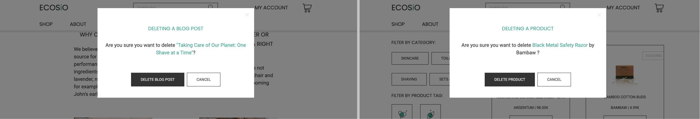
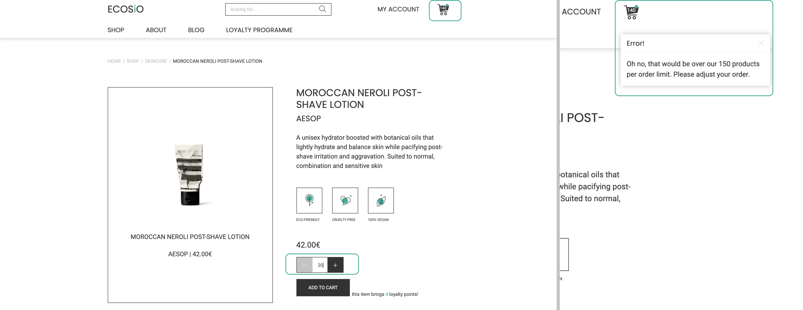
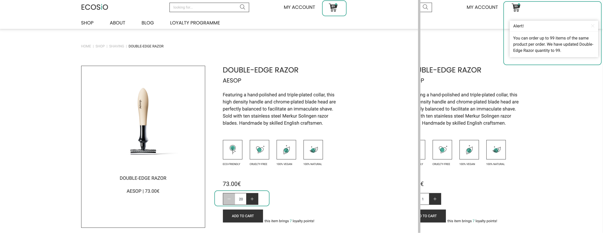
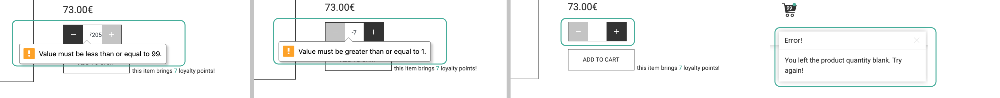

# Testing and Defensive Design

## Table of Contents

  * [**Defensive Design and Predicted Error Points**](#defensive-design-and-predicted-error-points)
    + [Custom Error Webpages](#custom-error-webpages)
    + [Secured Admin Views](#secured-admin-views)
    + [Modals When Permanently Deleting Data](#modals-when-permanently-deleting-data)
    + [Search Queries Safe for Site Structure](#search-queries-safe-for-site-structure)
    + [Maximum Items per Order - 150](#maximum-items-per-order---150)
    + [Maximum Same Products per Order - 99](#maximum-same-products-per-order---99)
    + [User-Frienly Product Page Input](#user-frienly-product-page-input)
    + [Cart Adjustments](#cart-adjustments)
    + [Product and Blog Images](#product-and-blog-images)
    + [Manipulating Loyalty Points Donation](#manipulating-loyalty-points-donation)
  * [**Testing**](#testing)
    + [Testing the Features](#testing-the-features)
    + [User Testing Results](#user-testing-results)
    + [Bugs, Problems and Vulnerabilities](#bugs--problems-and-vulnerabilities)

## Defensive Design and Predicted Error Points

In this chapter I will focus more on which steps I've taken to prevent predicted errors and complications. In the beginning I focused
more on the actions that could break the site or site structure completely, and afterwards more on restrictions that would make
sense for this project in general.

### Custom Error Webpages
* includes error 400, 403, 404 and 500
* since errors do happen anyways, no matter how well the defensive design has been thought through, I believe custom error pages are better for the user experience
* these pages inform the user of the error that has just happen but at the same time don't disrupt the user's mindset by a sudden change of environment (brand-friendly to foreign page design) and they support user's journey throughout the app better (by having links to return to other parts of the web app)

### Secured Admin Views
* admin-related activities happening on the site, such as adding, editing and deleting products or blog posts - are secured for superusers
* if a user still tries to access those pages, they are redirected to the homepage with a toast saying that only ECOSiO's team is allowed to do these actions
* this has been done by:
    * importing `@login_required` decorator in `views.py` files
    * redirecting to the homepage
    * displaying error toast message



### Modals When Permanently Deleting Data
* some admin-related activities such as deleting products and blog posts are permanent
* a modal will pop up to double check whether a user really wants to do such action or not
* when it comes to removing items from the cart, no modal appears since this is not a permanent action and products can easily be re-added to the cart



### Search Queries Safe for Site Structure
* firstly, if the query is an empty string, users are redirected to the webshop with a toast message
* long search queries without white spaces, or search queries that are simply too long, could break the site's responsiveness and structure
* for that reason, the following actions have been taken:
    * search box `<input>` is restricted to `maxlength="50"`
    * search term in breadcrumbs is restricted to `{{ search_term|truncatechars:25 }}`
    * search term length on the page is limited by `{{ search_term|truncatechars:50 }}`
* this also helps with link manipulation demonstrated below, in case users try to type the search query directly in the link so that the restrictions mentioned earlier are avoided


### Maximum Items per Order - 150
* a user can order up to 150 items per order
* the code can be found in `views.py` in the `cart` app
* in short, the system sums the quantity of items that are already in the cart with the quantity that is being submitted to the cart
* if the calculated sum is higher than the limit (150 products), the user gets a toast message that this is not possible and gets redirected to the same page they were on
* an example of this error would be when there are 140 products in the cart and the user tries to add 20 more items (new total would be 160 which is higher than the limit of 150)



### Maximum Same Products per Order - 99
* when it comes to individual products per order, a user can order up to 99 same items
* products can be added to the cart at 4 places within the web app:
    * by clicking 'add to cart` button on the homepage ('our most popular products' section)
    * by clicking 'add to cart` button in the webshop's product feed (product cards)
    * by defining product's quantity through the input field on the product page (+/- input field) and confirming by clicking on the 'add to cart` button
    * by clicking 'add to cart` button on the product page ('recommended for you' section)
* the code can be found in `views.py` in the `cart` app
* in short, the system checks if the product's ID is already in the cart, takes its quantity, sums it with the quantity that is being submitted and compares it to the limit of 99 same items per order
* if the amount is higher than 99, and the general limit of maximum 150 products per order hasn't been reached, the system changes the current quantity to maximum 99 items in the cart and alerts the user of the changes
* an example of this error would be when there are 89 products in the cart already and the user tries to add 20 more on top of that through the product page input box (new total would be 109 which is higher than the limit of 99) - the system rounds the quantity to 99 instead of 109



### User-Frienly Product Page Input
* product pages work a bit differently when it comes to adding products to the cart than the 'add to cart' buttons
* 'add to cart' buttons will increase the quantity of the product by 1, while on product pages, users can submit a bulk number which might be prone to manipulation
* for that reason, the following actions have been taken:
    * the `<input>` tag takes in only numbers as value (`type="number"`) between `min="1"` and `max="99"`
    * if users try to submit empty value, they are redirected to the product page with a toast message



### Cart Adjustments
* similar code has been implemented in the `cart` app as well - a user can't adjust a product's quantity to higher than 99 nor exceed the 150 products in total per order
* however, if users 'update' the cart item to the same number, a toast message appears informing them no changes have been made
* since no errors have technically been made here, I thought this might be a small help in case the user actually tried to change the amount of the product but ended up with the same amount anyhow
* the code can be found in `views.py` in the `cart` app

### Product and Blog Images
* additional precautions were taken when uploading new products and blog posts
* new products have image as an optional field in their model - if there is no image uploaded, a generic `no_image.png` is used as a placeholder
* when it comes to blogs, their images are also header images, so I've made that a mandatory field in the model
* it could happen that the blog image gets deleted from AWS bucket for example - if that happens a simple JavaScript code replaces the images with a `no_image_blog.png` file
```bash
// handle broken blog header images
$('.blog-header-image').on("error", function() {
    $(this).attr('src', '/media/no_image_blog.png');
});
```

### Manipulating Loyalty Points Donation
* registered users that have collected at least 61 loyalty points and unlocked level-2 feature of donating points might try to manipulate this feature
* the users donate points by clicking on the cause they want to contribute to
* the same could be done by typing links into the browser, such as:
    * `http://ecosio.herokuapp.com/profile/donate_plant_tree/`
* this particular action would donate 2 loyalty points to planting a tree with ECOSiO
* users could potentially try to keep on 'donating' their points until they reach either points in negative values, or 0 - which would be their access to a new 10% discount valid only for first orders, i.e. users with no loyalty points
* this has been handled in `profiles` app `views.py` file, where a rule has been added that you cannot donate points if you have less than 61 points
* this way a user can still make donations by typing a link but at least it's not possible to do this endlessly, the feature is available to only level-2 and level-3 users as imagined and, in the end, the user is only losing their own points and benefits - so hopefully no one would want to do this to themselves anyways in the first place
* if users with less than 61 loyalty points try to access the donations via link, the system redirect them to the same page and shows a toast message informing them they don't have enough points to do the action

<div align="right">
    <a href="#table-of-contents"> ⇧ Back To Top </a>
</div>

## Testing

The project's code was frequently validated through:

* [W3 HTML validator](https://validator.w3.org/)
    * the validator found some mistakes that were easy to fix, such as:
        * empty `<h1>` tag
        * unnecessary type attribute `<script type="text/javascript">`
        * having `<div>` tag as child of the `<button>` tag
        * having `<div>` tag as child of the `<ul>` tag
    * and there were a few errors that I haven't fixed yet due to the shortage of time
        * admin views for the `blog` page and the product feed (webshop) have duplicated `id` attributes because of the bootstrap modal
        * the form in admin `add_product` view has two `id` attributes for the image input, it happened because of additional implementation of custom widget template code
        * `cart` page has duplicated `id` attributes as well for the 'delete from cart' functionality, it happened because some parts of the code were hidden on smaller devices so the code appears twice on the page
* [W3 CSS validator](https://jigsaw.w3.org/css-validator/)
    * all errors and warning shown are related to either Bootstrap's css file, CSS browser prefixes or CSS variables that I've used (which is too advanced for this validator)
* [JSHint](https://jshint.com/)
    * apart from minor changes, like missing semicolons, everything was all right ('$' was not defined by JSHint however)
* [PEP8 validator](http://pep8online.com/)
    * all Python code was run through the PEP8 validator
    * the only errors I've found were slightly off indentation, which is corrected now, and `line too long` errors, which I plan to correct at later point since this isn't technically an error and this task would be very time-consuming at this point

The web app was tested on the devices and browsers listed below. I loaded the page on each of the device and browser combination
and looked for any visual and functional errors. I've also tried to resize the web pages on desktop in Chrome, Firefox, Opera and
Safari developer tools to look for hidden irregularities and finding out the solutions. More about the errors I've encountered can
be found under the 'Bugs, Problems and Vulnerabilities' section.

Desktop:

* MacBook Pro
    * Google Chrome
    * Safari
    * Opera
    * Firefox

Mobile:

* iPhone 8
    * Safari
* HTC
    * Google Chrome

### Testing the Features

**Navigation**
* click on all links to see if they work properly
* click on the cart icon to see if it's linked properly
* add a product into cart to see if the cart turns black, has a green circle and counts the quantity of the products correctly
* resize the browser to see if the navbar collapses into the hamburger menu
* scroll up and down to see if the navbar is fixed on the top
* log in and see if the 'My Account' links change from 'Register' and 'Login' to 'My Account' and 'Logout'
* log in as an admin and see if there are additional links to 'Add New Product' and 'Add New Blog' forms

**Search functionality**
* search for a relevant keyword (such as soap, shampoo, conditioner, etc.) of your choice to see if the search results are rendered properly on the page and the site structure is intact
* search for an irrelevant keyword (such as couch, bedsheets, hamburger, etc. ) of your choice to see if the page without results is rendered properly and the site structure is intact
* try to type an input longer than 50 characters to see if the search bar limits your input
* search for the longest input you can type and see if the page is rendered properly and the site structure is intact
* search by submitting an empty input to see if you get redirected to the webshop with a toast message that nothing was submitted
* try to manipulate the link in the browser by adding more than 50 characters at the end of and pressing enter key to see if the search results are rendered properly on the page and the site structure is intact 

**Breadcrumbs**
* click on the 'Shop' link in the navbar and check if you see the breadcrumbs in the top left corner of the webshop
* click on the filters to see if the breadcrumbs and product count change accordingly
* click on a product card to see if the breadcrumbs on the product page contain that products category and name
* try adding more products to the cart and visit the cart page to see if the breadcrumbs change to 'Shopping Cart'
* click on the 'Checkout' button to see if you reach the 'Checkout' page and breadcrumbs render properly
* do a test order to see if you reach 'Order Confirmation' page and breadcrumbs render properly
* go to your profile by clicking on 'My Account' link in the navbar and check if you see the breadcrumbs in the top left corner of the page
* click on 'Order History' button to see if the breadcrumbs change accordingly
* go back or click on the 'My Profile' breadcrumb to go back to your account page
* click on 'Check Loyalty Status' button to see if the breadcrumbs change accordingly
* go back or click on the 'My Profile' breadcrumb to go back to your account page
* click on 'Edit Profile Details' button to see if the breadcrumbs change accordingly

**Toasts**
* do a few actions of your choice mentioned below to see if the toast message appears in the top right corner
    * add a product to the cart
    * add more than 99 same items to the cart
    * add more than 150 products to the cart
    * update the products in the cart
    * remove an item from the cart
    * complete a checkout
    * log in
    * donate loyalty points
    * log out, etc.
* do some of these actions on mobile devices as well

**Django-allauth feature**
* try to register for an account
* see if you've received a verification e-mail and verify your e-mail
* try to log in with your credentials and see if you're redirected to your account
* try to log out of the web app
* try to reset your password and see if you receive an e-mail with instructions
* choose a new password and try to change it
* try to log in with your new credentials

**Automatic e-mails**
* to test automatic emails, you can do some of the following actions
    * make a test order
    * register for an account
    * reset your password
* see if you've received an email from 'ecosio.cosmetics@gmail.com'

**Homepage app**
* click on the logo in the navigation and see if the page renders properly
* try adding a product into the cart by clicking on 'add to cart' buttons of the products displayed in the 'Our Most Popular Products' section
* click on one of the CTAs in the 'Curated Shopping for You' section to see if you're led to the prefiltered shopping feed matching the category you've clicked on
* test other CTAs and see if the links work properly
* resize the page to see if the 'Our Most Popular Products' turn into a scrollable gallery
* click on the dark gray registration prompt to see if the CTA leads you to the registration page
* test if closing registration prompt works without any issues
* log in and check if the registration prompt is hidden for logged in users on the homepage

**About app**
* click on 'About' link in the navigation and see if the page renders properly
* test the CTAs and see if the links work properly
* resize the page and see if everything looks all right

**Blog app**
* click on 'Blog' link in the navigation and see if the page renders properly
* check if you can see blog post cards
* if you're an admin, check if you see an 'edit' and 'delete' icon in the top left corner of each blog post card
    * try to edit a blog post by clicking on the 'edit' icon
    * see if there is 'Add New Blog' link in the navigation
    * try to add a new blog post by clicking on 'Add New Blog' link in the navigation and submitting a blog post
    * click on 'Blog' link in the navigation and see if you can find that blog post
    * try to delete that blog post by clicking on the 'delete' icon
    * click on a blog post and test 'edit' and 'delete' functionalities from the blog post page
* resize the page and see if everything looks all right
* click on a blog post of your choice and see if the page renders properly
* if you're an admin, check if you see an 'edit' and 'delete' icon in the top left corner below the header image
* resize the blog post page and see if everything looks all right
* click on the 'Shop Here' button and see if you're redirected to the webshop

**Loyalty Programme app**
* click on 'Loyalty Programme' link in the navigation and see if the page renders properly
* test the CTAs and see if the links work properly
* resize the page and see if everything looks all right

**Products app, i.e. Webshop**
* click on 'Shop' link in the navigation and see if the page renders properly
* test the filters and see if the breadcrumbs and product selection change accordingly
* try adding a product into the cart by clicking on 'add to cart' buttons of the products displayed in the webshop
* if you're an admin, check if you see an 'edit' and 'delete' icon in the top left corner of each product card
    * try to edit a product by clicking on the 'edit' icon
    * see if there is 'Add New Product' link in the navigation
    * try to add a new product by clicking on 'Add New Product' link in the navigation and submitting a new product description
    * click on 'Shop' link in the navigation and see if you can find that product
    * try to delete that product by clicking on the 'delete' icon
    * click on a product in the shop and test 'edit' and 'delete' functionalities from product page
* resize the page and see if everything looks all right
* click on a product of your choice and see if the page renders properly
* if you're an admin, check if you see an 'edit' and 'delete' icon in the top left corner of the product image
* resize the product page and see if everything looks all right
* click on 'Ingredients' and 'Shipping Details' accordion cards to see if the cards slide down
* try to click on `+/-` input buttons and see if you can add that quantity of the product to the cart with a success toast displayed
* try typing in a number within the range 1-99 and see if you can add that quantity of the product to the cart with a success toast displayed
* try typing a number higher than 99 and see if you get an error toast message
* try submitting an empty input and see if you get an error toast message
* try adding products from the 'Recommended for You' section into the cart
* try adding more than 150 various products to the cart and see if you get an error toast message

**Cart app**
* click on the cart icon in the navigation and see if the page renders properly
* test adding and removing products from the cart to see if the empty cart turns black and counts products in the cart
* click on the products to see if you're redirected to their product pages
* check if the data per line item is correctly displayed and calculated
* try to click on `+/-` input buttons and see if you can adjust the quantity of the product with a success toast displayed
* try typing in a number within the range 1-99 and see if you can adjust the quantity of the product with a success toast displayed
* try typing a number higher than 99 and see if you get an error toast message
* try submitting an empty input and see if you get an error toast message
* try updating a product without adjusting the quantity and see if you get a toast message as a reminder
* try updating products in the cart in a way that there are more than 150 various products to see if you get an error toast message
* resize the cart page and see if everything looks all right
* scroll to the bottom and see if the costs are displayed properly
    * there should be order total, chipping costs and total costs correctly calculated
    * if the order is worth 120.00€ or more, the shipping costs are free
    * if the order is worth less than 120.00€, the shipping costs are 4.00€
    * if the user is registered and this is the first order per account, a 10% discount should be applied to order total
    * if the user is registered and has a level-2 or level-3 loyalty status, the shipping costs for order of any value should be free

**Checkout app**
* click on the 'Checkout' button at the bottom of the cart page
* see if all the order data is correctly displayed and calculated
* resize the checkout page and see if everything looks all right
* if applicable, check if the discounts from the cart page are correctly displayed and calculated here as well
* try submitting a form with some of the input fields empty to see if you get error messages
* fill in the form as an anonymous user and do a test transaction
    * **credit card:** 4242 4242 4242 4242
    * **expiration date:** 04 / 24
    * **CVC:** 424
    * **ZIP:** 42424
* fill in the form as a logged in user and check the 'Save this delivery information to my profile' box
* do a test transaction and see if you're redirected to the 'Order Confirmation' page
* for logged in users:
    * check in your account if the shipping information was properly saved on 'Edit Profile' page
    * check in your account if the order appears in the 'Order History'

**Profiles app - and Loyalty Programme feature**
* register for an account and log in by clicking on the 'Login' link in the 'My Account' dropdown in the top right of the navigation (in the burger menu on mobile devices)
* see if the page renders properly - you should be seeing 4 buttons linked to:
    * the order history page ('Order History' CTA)
    * the loyalty status page ('Check Loyalty Status' CTA)
    * the edit profile page ('Edit Profile Details' CTA)
    * the webshop ('Shop Now' CTA)
* click on each CTA to see if the pages render properly
* resize each page and see if everything looks all right
* the order history page should display your orders - if you haven't made any orders yet, you should see a CTA to the webshop and a CTA to your loyalty status page
* the loyalty status page should display your points, your donated points and unlock the level you currently belong to as well as show a sneak peek of the levels you will unlock in the future
* if you are a level-2 customer, you should have access to the donation system - test the donations by clicking on each of the three causes and see if a toast message appears as a confirmation of the action and your points get deducted
* if you are a level-3 customer, you should have access to the event registration - test it by clicking on the 'Yes, I'm Coming' CTA and see if a toast message appears as a confirmation of the action and your CTA turned into a confirmation note
* the edit profile page should display your saved information that is pulled into the checkout form for a smooth check out - change the information and save it to see if everything gets saved properly
* test if the form is able to save empty fields as well - some customers might not want to have all of their details saved to the profile so this should be working fine
* additionally, do a test transaction to see if the new details are correctly displayed in the checkout form

### User Testing Results

Apart from my own efforts, the web app was tested by my friends and family members. The feedback was in general highly positive.
There was one issue that I fixed immediately, which was increasing the size of the delete icon on the `cart` page on mobile devices.
This feature removes a product from the cart but since it was so small, it was difficult to click directly on it. As the icon is on top of
the product image which is linked to the product page of that product, it would often happen that the user ended up there and had to go
back to the cart. I've fixed this by:
* increasing the icon's size
* increasing the clickable area around the icon

There were also minor styling suggestions like adding more padding and margins to some elements.

Other suggestions I've got would require more time, bigger code refactoring or simply careful and detailed planning to achieve them.
Since none of these were actually bugs or errors and users have quickly realised how the web app works, I've decided to leave them
for later improvements of the MVP. The suggestions were:
* removing the paragraph CTAs like 'Register Here' from the `homepage` for logged in users
* two users suggested removing the 'update' link from `cart` and that the item updating should happen whenever a `+/-` input field is clicked on
* keeping the 'Sort Products By' filter in the webshop even after clicking on a category or a product tag filter
* toast doesn't disapear if hovered so that the user has more time reading it
* user can combine filters in the webshop, such as 'Skincare' and '100% Organic'
* adding tooltips when hovering over keywords, such as 'ECO-EXPERT'
* having more payment options
* highlighting the filter that's been applied in the webshop - it seems that the breadcrumbs (where this information is currently displayed) are often overlooked or users simply don't look there to find this information

### Bugs, Problems and Vulnerabilities

**Loyalty Programme**

The most challenging task for this project was to think of and create the logic for the loyalty programme. After discussing
with my mentor about the possibilities it was clear that this should be connected to user profiles. For that reason I've decided
to simply implement the points tracking as part of the user profile and extended the `UserProfile` model.

The biggest challenge was writing the code that would track the points automatically whenever an order has been made. Several tutors
from CodeInstitute and I tried to think of solutions, but we kept running into errors or problems until we've come up with an idea that
the loyalty points should be added to the `UserProfile` whenever an order has been placed instead of attaching them to the orders and pulling
the data from orders. This serves the purpose of this MVP well and it was very easy and quick to implement it.

This solution, however, causes one issue, which is that if the order confirmation page is refreshed or accessed again after the 
checkout, the points will be added to the profile again. This shouldn't be happening as users could manipulate the system to get more
points. In the long run, loyalty programme would definitely need a makeover.

This also means that if an order is placed by accident and the user gets in touch with the customer service to delete the order, the
order will be deleted but the points would have to be manually removed from the profile by admins.

Loyalty programme currently doesn't have a time limit. I've imagined it to be reset every year but haven't had the time to implement this
into the system. At the moment, users can keep ordering and collecting points without an end to it.

**Webhooks**

Another challenge I've come across were webhooks. I deployed the project to Heroku with automatic e-mails in place so everytime
I ordered something in the development mode, the order would be made in the database of the deployed project. This caused confirmation
e-mails being sent out with a different order ID and wrongly calculated costs - as the costs depend on user's loyalty points (such as,
10% discount and free shipping for level-2 and level-3 users).

Luckily, a CodeInstitute's tutor was familiar with the issue, so I was assured everything would be all right for the deployed project.

**Cross-Browser CSS Issues**

For my previous project, I manually added all the browser prefixes whenever I came across a problem. It was a long, exhausting
process, so I was very happy when I was pointed to [Autoprefixer](https://autoprefixer.github.io/).

Autoprefixer saved me a lot of time and efforts right from the beginning and there was only one outline that I had to fix
for Safari browser.

<div align="right">
    <a href="#table-of-contents"> ⇧ Back To Top </a>
</div>